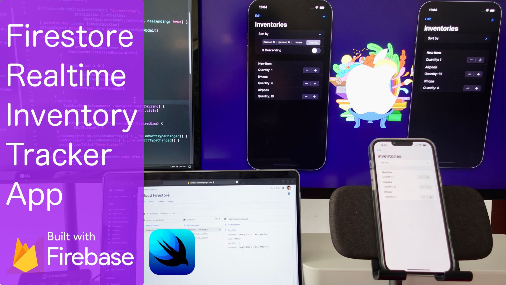

# Firestore Realtime Inventory Tracker SwiftUI App

## Description

This app is the source code repository for YouTube tutorial for learning on [how to build SwiftUI App using Cloud Firestore as cloud database](https://youtu.be/ThsEZrwcpYc)

It has the following features:
 - Query data using @FirestoreQuery property wrapper
 - Update document
 - Add document
 - Delete document
 - Using Query Predicate to order the list

## Getting Started

- Clone the project
- Create your own Firebase project
- Enable Cloud Firestore
- Install Firebase Local Emulator Suite to enable localhost testing with simulator
- Provide your bundle id based on the iOS app that you added in Firebase project
- Copy and Paste your Google Info Plist to the project

## Author

Alfian Losari, alfianlosari@gmail.com
